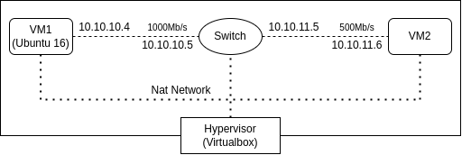

# DPDK/MTCP in VirtualBox

This walkthrough is designed to follow setup a Virtual Testbed in Virtualbox comprised of 2 sender/reciever VMs, each residing in a seperate subnet connected to one another by a Router VM. 

<p align="center">
  
</p>

This constellation allows for customization and testing in a simulated real networking environment. 

The contents of this walkthrough is as follows.

1. [Testbed Installation](testbed_installation/)

- This guide contains a one-shot script to download an Ubutnu ISO and setup the 3 VMs and Networks

2. [DPDK Installation](dpdk_installation/)

- This guide explains how to install DPDK and run some basic sender/reciever examples

3. [mTCP Installation](mtcp_installation/)

- This guide a (challanging) walkthrough how to install and compile mTCP to allow you to develop your own TCP level functionality within DPDK


## Tested Environments

1. Kernel - 5.15.0-52-generic; gcc version 11.3.0 (Ubuntu 11.3.0-1ubuntu1~22.04)
2. Kernel - 4.4.0-186-generic; gcc version 5.4.0 (Ubuntu 5.4.0-6ubuntu1~16.04.12)


## Contact

```
Peter Bangert - petbangert@gmail.com
```

