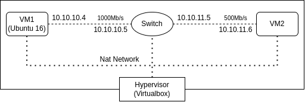

# PowerTCP-KernelBypass Testbed Setup

### Setup Testbed

<p align="center">
  
</p>

#### Virtualbox Setup

   1. Under Tools->Preferences->Network create a NAT Network

   This Nat Network allows for typical NATing for outbound connections but also allows internal connections between VMs and alows VMs to have unique IPs inside NAT network, easier for controlling from host machine. 

#### VM Setup

   1. Two Ubuntu 16.04 headless server images

      Download: https://releases.ubuntu.com/16.04/ubuntu-16.04.7-server-amd64.iso

   2. Follow this guide for step by step setup of VMs
   
      Guide: https://blog.emumba.com/setting-up-virtual-machines-for-dpdk-da1b49a9bf5f


   3. Give 2VCPUs, 2GB RAM, 20-30GB hard disk.

   4. Run through installation setup

#### Network config

   
   1. Internal Network adapter 1: subnet 10.10.10.X

```
vboxmanage dhcpserver add --netname intnet1 --ip 10.10.10.1 \ 
--netmask 255.255.255.0 --lowerip 10.10.10.2 --upperip 10.10.10.212 --enable
```

   2. Internal Network adapter 2: subnet 10.10.11.X

```
vboxmanage dhcpserver add --netname intnet2 --ip 10.10.11.1 \ 
--netmask 255.255.255.0 --lowerip 10.10.11.2 --upperip 10.10.11.212 --enable
```

   3. In VM1

   - Goto Settings->Network->Adapter 2
   - Enable Adapter 2, Attach to Internal Network
   - Set Name: intnet1

   4. In VM2 

   - Goto Settings->Network->Adapter 2
   - Enable Adapter 2, Attach to Internal Network
   - Set Name: intnet2

   5. In Router1

   - Attach Adapter 2,3 to internal networks 1,2 respectively
   - Start VM
   - Allow IP forwarding

   ```
   vim /etc/sysctl.conf
   > Uncomment or add this line:
   net.ipv4.ip_forward=1
   > exit
   sysctl -p
   ```

   - Add lines to `/etc/network/interfaces`

   ```
   auto enp0s8
   iface enp0s8 inet static
      address 10.10.10.5
      netmask 255.255.255.0
   
   auto enp0s9
   iface enp0s9 inet static
      address 10.10.11.5
      netmask 255.255.255.0
   ```


   5. Adjust VMs to have different IP addresses on main VNIC

```
sudo rm /etc/machine-id
sudo systemd-machine-id-setup
```

#### Next Steps

1. Follow `mtcp-installation` guide

